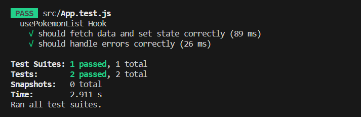

# Iskra


### Prueba técnica para Iskra

Preview:
[demo desplegada, hecha con cariño ¡espero que os guste!](https://loving-mice.surge.sh/) 


## Setup

### `npm install && npm start`

Ejecuta la aplicación en el modo de desarrollo.\
Abra [http://localhost:3000](http://localhost:3000) para verlo en el navegador.

### Para ejecutar la prueba test: npm run test



# Parte teórica

Código anterior:

```js

class RegisterUser {

  constructor(services = []) {
    this.services = services
  }

  getTotal() {
    let total = 0;

    this.services.forEach((service, index) => {
      let multimediaContent = service.multimediaContent()

      if (typeof service == StreamingService) {
        total += multimediaContent.StreamingPrice
      } else if (typeof service == DownloadService) {
        total += multimediaContent.DownloadPrice
      }

      if (typeof multimediaContent == PremiumContent) {
        total += multimediaContent.additionalFee;
      }

    })

    return total
  }
}
```

He identificado ciertos errores de sintaxis y noté que toda la lógica se encuentra concentrada en la clase RegisterUser. 
Sería recomendable dividir esta lógica en diferentes clases para una mejor organización. 
Además, en el constructor, no se están inyectando los servicios necesarios y faltan algunos otros atributos. 
En general, la abstracción del código no es óptima y es necesario mejorar la encapsulación del mismo.

```js

/* 
  Esta clase representa el contenido multimedia y tiene dos propiedades: 
  streamingPrice y downloadPrice. 
  Esta clase sirve como base para otros tipos de contenido multimedia.
*/


class MultimediaContent {
    constructor(title, streamingPrice, downloadPrice) {
      this.title = title;
      this.streamingPrice = streamingPrice;
      this.downloadPrice = downloadPrice;
    }
  }
  
  /*
    Esta clase hereda de MultimediaContent y agrega una propiedad adicional llamada additionalFee. 
    Representa contenido premium que tiene un costo adicional además de los precios de transmisión y descarga.
  */
  
  class PremiumContent extends MultimediaContent {
    constructor(title, streamingPrice, downloadPrice, additionalFee) {
      super(title, streamingPrice, downloadPrice);
      this.additionalFee = additionalFee;
    }
  }
  
  // Esta clase representa un servicio multimedia genérico y toma un objeto.
  class Service {
    constructor(multimediaContent) {
      this.timestamp = Date.now();
      this.multimediaContent = multimediaContent;
    }

    getMultimediaContent() {
      return this.multimediaContent;
    }
  }
  
  /* StreamingService y DownloadService: estas dos clases son subclases de Service y representan servicios de Streaming y Download, 
    respectivamente. Heredan la propiedad multimediaContent de la clase base Service.
  */
  
  class StreamingService extends Service {
    constructor(multimediaContent) {
      super(multimediaContent);
    }
  }
  
  class DownloadService extends Service {
    constructor(multimediaContent) {
      super(multimediaContent);
    }
  }
  
  // La clase RegisterUser es la que realiza el cálculo del costo total de los servicios seleccionados por un usuario.
  
  class RegisterUser {
    constructor(services = [], email) {
      this.services = services;
      this.email = email;
    }
  
    getTotal() {
      let total = 0;
  
      for (const service of this.services) {
        const multimediaContent = service.multimediaContent;
        
        total += multimediaContent.streamingPrice;
        total += multimediaContent.downloadPrice;
        
        if (multimediaContent instanceof PremiumContent) {
            total += multimediaContent.additionalFee;
        }
      }
  
      return total;
    }
  }
  
  // Ejemplo:
  const premiumContent = new PremiumContent('Avatar', 10, 2, 5);


  const streamingService = new StreamingService(premiumContent);
  const downloadService = new DownloadService(premiumContent);

  console.log(downloadService.getMultimediaContent())
  
  const user = new RegisterUser([streamingService, downloadService]);
  
  console.log(user.getTotal());