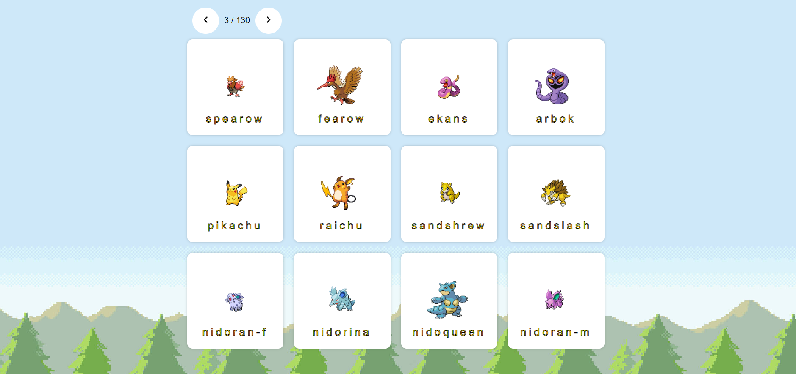
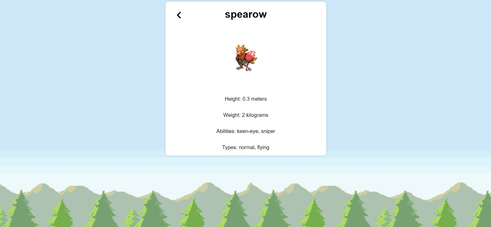

# Iskra

### Technical test for Iskra

Preview:
[deployed demo, made with love hope you like it!](https://cheerful-partner.surge.sh/) 

## Funcional Description

- see pokemon
- see pokemon details

##  WorkFlow

## Setup

In the project directory, you can run:

### `npm install && npm start`

Runs the app in the development mode.\
Open [http://localhost:3000](http://localhost:3000) to view it in the browser.

